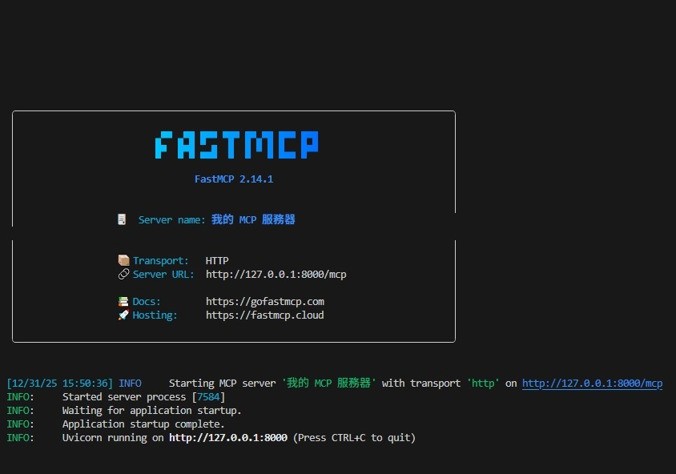
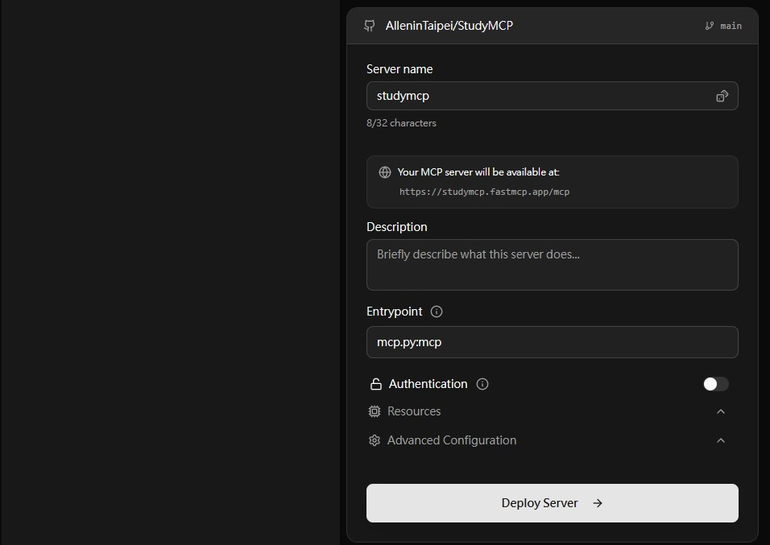
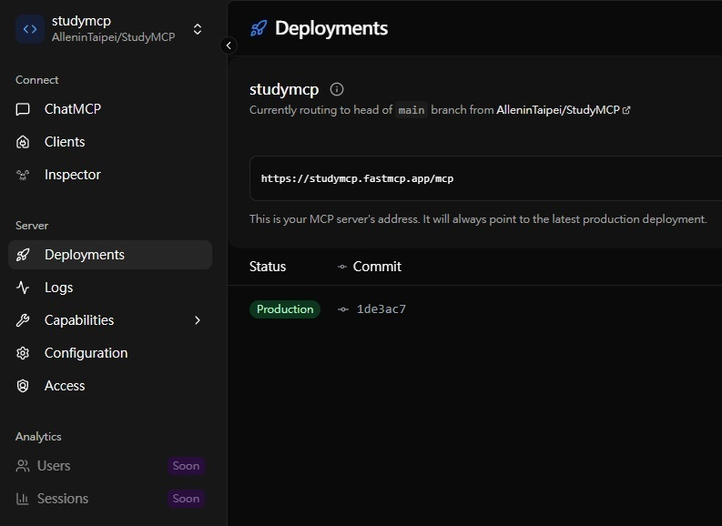

--- 
marp: true
theme: gaia
backgroundColor: #181818
color: #EEF8F7
paginate: false
---

# Study AI Agents

- Introduction to Agents
- Agent Tools & Interoperability with Model Context Protocol (MCP)
- FastMCP Cloud
- Context Engineering: Sessions & Memory

ASRock AI Center
Allen Sun 

---

# Introduction to Agents
5-Day AI Agents Intensive Course Day 1

---

## 核心轉變：從被動 AI 到自主 AI Agent

|傳統 AI|AI Agent|
|:-|:-|
|被動回應（問答、翻譯）|具備目標導向<br>能規劃、行動、觀察<br>可在多步驟中自主完成任務|
|PoC|MVP|

---

## Agent 的三大核心組成

|Agent|思考 + 行動 + 指揮|
|:-|:-|
|Model<br>大腦|LLM 推理引擎<br>管理 Context（任務、記憶、工具結果）|
|Tools<br>雙手|API、資料庫、RAG、程式碼執行<br>|讓 Agent 能「做事」|
|Orchestration Layer<br>指揮|控制流程、狀態、策略<br>負責執行整個 Agent Loop|

---

## Agent 的基本運作循環

Agentic Loop = Think → Act → Observe → Think

```bash  
1. 接收任務目標
2. 評估工具與記憶
3. 規劃下一步
4. 呼叫工具執行
5. 觀察結果並更新 Context，🔁 持續循環直到任務完成
```

---

## Agent 能力分級

* 純 LLM：無工具、無即時資訊
* 連網問題解決者：可使用工具查詢即時資料
* 策略型問題解決者：Context Engineering（用前一步結果精準塑造下一步輸入）
* 多 Agent 協作系統：Agent 彼此視為工具，可進行「目標委派」，各自執行完整計畫後回傳結果
* 自我演化系統（前沿）：能識別自身能力缺口，可動態建立新 Agent 或工具來補足能力

---

<style scoped>section{font-size:32px;}</style>

## 走向生產環境的關鍵工程實務

* 模型選擇與 Routing
  * 複雜規劃 → 高階模型
  * 簡單高頻任務 → 快速低成本模型
* 工具可靠性
  * 使用 RAG、向量資料庫、NL2SQL 進行資料檢索
  * 透過 Function Calling（結構化工具描述），確保模型能正確呼叫與解析結果
* 記憶管理
  * 短期記憶：當前任務的思考與行動紀錄
  * 長期記憶：跨任務的偏好、知識與經驗（常用向量資料庫實作）

---

## AgentOps：測試、除錯與觀測

測試方式改變：不驗證固定輸出，而是驗證「品質」

* LLM as Judge（用 AI 評估 AI）
* Golden Dataset（標準測試情境）
* 使用 trace 記錄完整推理與工具呼叫流程（像飛行紀錄器）
* 人類回饋真實錯誤會轉為永久測試案例，防止重複發生

---

## 安全、治理與規模化

* 採用 Defense in Depth（多層防禦）
  * 程式層 guardrails（硬規則）
  * AI Guard Models（風險行為偵測）
* Agent 身分識別
  * Agent 擁有獨立身分與最小權限（非使用者代言）
* Agent Governance
  * 透過中央 Gateway 控制 agent、工具、agent-to-agent 通訊

---

## 持續學習與模擬

* Agent 需透過執行紀錄、使用者回饋、政策更新持續優化
* Agent Gym（模擬環境）
* 在非正式環境中壓力測試多 Agent 協作與新情境

---

## 成功的 Agent 不只靠模型聰明，而是取決於：

* 架構設計
* 工具與編排
* 測試、觀測、安全與治理

開發者角色正在轉變：從寫程式的人 → 設計、指揮、治理自主 AI 系統的架構師。

---

# Agent Tools & Interoperability with Model Context Protocol (MCP)
5-Day AI Agents Intensive Course with Google - Day 2

---

## 為何需要 Agentic AI

* 基礎模型雖然聰明，但受限於訓練資料，無法即時感知世界或直接採取行動。
* LLM 是「大腦」，工具（Tools）是「眼睛與手」，讓模型能查詢即時資訊、呼叫 API、修改系統狀態。

---

<style scoped>section{font-size:26px;}</style>

## 工具（Tools）的定義與類型

工具是 LLM 無法原生完成、但可透過外部函式或系統執行的能力

* Function Tools（函式工具）
  * 開發者自行定義的外部函式（如 Python）
  * 透過清楚的 docstring 定義輸入、輸出與行為（即「契約」）
* Built-in Tools（內建工具）
  * 模型平台隱含提供，如搜尋（Grounding）、程式碼執行、抓取 URL 內容
* Agent Tools（代理工具）
  * 將「另一個代理」當作工具呼叫
  * 主代理仍保有控制權，屬於階層式委派，而非完全交接任務

此外，工具也可依功能分類為：資訊擷取、動作執行、系統 API 整合、人類介入（Human-in-the-loop）。

---

<style scoped>section{font-size:28px;}</style>

## 工具設計的關鍵最佳實務

* 文件至上（Documentation is paramount）
  * 工具名稱、描述、參數即是 LLM 的操作說明書
  * 明確命名遠勝於模糊命名
* 描述「要做什麼」，不是「怎麼做」
  * 讓 LLM 負責推理，工具只負責執行
* 封裝任務，而非暴露原始 API
  * 工具應代表高層次任務（如「預訂會議室」），而非複雜 API 呼叫
* 輸出要精簡
  * 避免將大量原始資料塞進 context
  * 回傳摘要、確認訊息，或指向外部資料的 URI
* 錯誤訊息需具指引性
  * 不只是錯誤碼，而是告訴 LLM 發生什麼事、如何恢復（如等待多久再重試）

---

<style scoped>section{font-size:32px;}</style>

## MCP（Model Context Protocol）

* 2024 年提出的開放標準，目標是解決過去「模型 × 工具」整合的指數型複雜度問題。將「推理（Agent）」與「執行（Tool）」徹底解耦，達成即插即用。
* 採用類似 LSP（Language Server Protocol）的 Client–Server 架構
  * MCP Host：主應用程式，負責使用者體驗、推理流程與安全政策
  * MCP Client：嵌在 Host 中，負責與 Server 通訊與 session 管理
  * MCP Server：提供實際工具，宣告能力、執行指令、回傳結果
  * 通訊協定：JSON-RPC 2.0
    * 本地：STDIO（快速、低延遲）
    * 遠端：Streamable HTTP（支援串流回傳）

---

## MCP 中的工具定義與錯誤處理 

工具以 JSON Schema 定義輸入與（可選）輸出

* 結構化：最理想、易於推理
* 非結構化：文字、圖片、音訊或外部資源 URI
* Protocol 層錯誤（方法不存在、參數錯誤）
* 工具執行錯誤（API 失敗等，透過 is_error 標示）

---

## MCP 帶來的整體價值

* 加速開發、促進工具生態系重用
* 支援工具動態發現，提升 Agent 自主性
* 架構高度模組化，有利於建構 Agent Mesh（代理網路）

---

<style scoped>section{font-size:24px;}</style>

## 主要挑戰：Context Window 與工具規模

* 若 Agent 同時可用上千個工具，context 會爆炸、成本高、推理品質下降
* 解法：Tool Retrieval（工具檢索）
  * 先用語意搜尋找出最相關的少數工具
  * 只將這些工具定義載入 context（類似 RAG，但用在工具）

## 企業級安全風險與解法

* MCP 本身不內建強式驗證與授權
* 重大風險：Confused Deputy（困惑代理）
  * 使用者透過提示注入，誘使高權限工具替其執行未授權操作
* 實務解法：
  * MCP 外層必須加上企業級 API Gateway
  * 負責身分驗證、細粒度授權、限流、審計、輸入過濾

---

## LLM 是大腦，工具是手腳
## MCP 正逐漸成為連接兩者的標準語言
## 真正成功的 Agentic AI 來自於：

* 良好的工具設計
* 精簡的輸出
* 可恢復的錯誤處理
* 以及 MCP 之外完善的安全與治理架構

---

# FastMCP Cloud
[🔗](https://fastmcp.cloud) 部署 MCP Server 的最快方法

---

<style scoped>section{font-size:28px;}</style>

## 觀念確認 (1/2)

### Model Context Protocol (MCP)

可以把它理解成一種 **API（Application Programming Interface）**，這個 **應用程式介面** 是專門為 LLM 互動所設計的。用來將 LLM 連接到工具與資料；而 FastMCP 則透過乾淨、符合 Python 風格的程式碼，讓它具備可用於正式環境的能力。

---

<style scoped>section{font-size:28px;}</style>

## 觀念確認 (2/2)

### Python main guard ( entry point pattern)

```python
if __name__ == "__main__:"
```
讓同一個 .py 檔案既能當模組被導入，又能當獨立程式執行

### Python docstring (documentation string)

```python
 """將兩個數字相加"""
```

```python
"""搜尋資料庫中的資料""" 
```

用來描述函數、類別或模組的功能說明。
當 AI Chatbot 使用你的 MCP 工具時，會讀取這個 docstring 來了解工具的功能，所以寫清楚的說明很重要!

---

<style scoped>section{font-size:28px;}</style>

## 部署準備

```bash
pip install fastmcp
```

## 開發測試

```python
from fastmcp import FastMCP

mcp = FastMCP("我的 MCP 服務器")

@mcp.tool()
def add_numbers(a: int， b: int) -> int:
    """Add Two Nimbers"""
    return a + b
```

啟動 FastMCP Server，讓 `mcp.py` 的 `mcp` 這個工具透過 HTTP 協議在 port 8000 運行。

```bash
fastmcp run mcp.py:mcp --transport http --port 8000
```

---

<style scoped>section{font-size:28px;}</style>

## 按 `CTRL-C` 關閉服務



---

<style scoped>section{font-size:24px;}</style>

#### 1️⃣ 建立 `git` 專案並 `commit mcp.py`
#### 2️⃣ 登入 FastMCP Cloud
#### 3️⃣ 關閉 Authentication 後 Deploy Server



---



---

# 🙏🏻 感謝 FastMCP 團隊

* 使用 FastMCP Cloud 的 ChatMCP 可以 進行測試
* 每次修改 `mcp.py` 再 `commit` 後 ，FastMCP 會自動重新 deploy
* MCP Server 的 Status、Log，都可以查詢

---

## 1️⃣ 抽象化複雜的 MCP 協議層

原始 MCP 協議的複雜度:

```python
# 原始 MCP 協議 (沒有 FastMCP 的話)
import json
from mcp.server import Server
from mcp.server.models import InitializationOptions
from mcp.types import Tool, TextContent

# 1. 建立 server 實例
server = Server("my-server")
```
---

```python
# 2. 定義工具的 JSON Schema
tool_schema = {
    "name": "add",
    "description": "Add two numbers",
    "inputSchema": {
        "type": "object",
        "properties": {
            "a": {"type": "number"},
            "b": {"type": "number"}
        },
        "required": ["a", "b"]
    }
}
```

---

```python
# 3. 註冊工具
@server.list_tools()
async def list_tools():
    return [Tool(**tool_schema)]

# 4. 處理工具調用
@server.call_tool()
async def call_tool(name: str, arguments: dict):
    if name == "add":
        result = arguments["a"] + arguments["b"]
        return [TextContent(type="text", text=str(result))]

# 5. 手動處理連接、協議、錯誤...
# 還要處理 JSON-RPC 格式、訊息路由、錯誤處理等等
```

---

## FastMCP 簡化了 90% 的程式碼

```python
from fastmcp import FastMCP

mcp = FastMCP("my-server")

@mcp.tool()
def add(a: int, b: int) -> int:
    """Add two numbers"""
    return a + b
```

---

## 2️⃣ 提供 Pythonic 的 API 設計

FastMCP 借鑒了 FastAPI 的成功設計模式:

| FastAPI | FastMCP | 核心概念 |
|---------|---------|----------|
| `@app.get()` | `@mcp.tool()` | 裝飾器模式 |
| 自動生成 OpenAPI | 自動生成 MCP Schema | 自動文檔 |
| Type Hints 驅動 | Type Hints 驅動 | 型別安全 |
| Pydantic 驗證 | Pydantic 驗證 | 自動驗證 |

---

### 實例：Type Hints 的威力

```python
from typing import List, Dict

@mcp.tool()
def process_data(
    items: List[str],           # ← FastMCP 自動知道這是字串陣列
    config: Dict[str, int],     # ← 自動知道這是字典
    threshold: float = 0.5      # ← 自動知道有預設值
) -> Dict[str, List[str]]:      # ← 自動知道回傳型別
    """處理資料"""
    # FastMCP 自動:
    # 1. 生成 JSON Schema
    # 2. 驗證輸入參數
    # 3. 處理型別轉換
    # 4. 產生錯誤訊息
    return {"filtered": [i for i in items if len(i) > threshold]}
```

---

### FastMCP 自動生成的 JSON Schema:
開發者只需要寫業務邏輯，其他都自動處理

```json
{
  "name": "process_data",
  "description": "處理資料",
  "inputSchema": {
    "type": "object",
    "properties": {
      "items": {"type": "array", "items": {"type": "string"}},
      "config": {"type": "object"},
      "threshold": {"type": "number", "default": 0.5}
    },
    "required": ["items", "config"]
  }
}
```

---

## 3️⃣ 內建完整的開發工具鏈
FastMCP 團隊不只是做了一個框架,而是做了整套生態系統:

### CLI 工具

```bash
# 快速啟動 (不用寫 main 函數)
fastmcp run server.py

# 支援多種傳輸協議
fastmcp run server.py --transport http --port 8000
fastmcp run server.py --transport stdio
fastmcp run server.py --transport sse

# 開發模式 (自動重載)
fastmcp dev server.py
```
---

### 內建測試客戶端

```python
# 不用啟動 Claude,直接測試你的工具
from fastmcp import Client

async with Client(mcp) as client:
    result = await client.call_tool(
        "add", 
        {"a": 5, "b": 3}
    )
    print(result)  # 8
```

---

## MCP Inspector 整合 - 視覺化除錯工具
- 所有工具列表
- 手動測試每個工具
- 查看 JSON 請求/回應

```bash
mcp-inspector fastmcp run server.py
```
---

## 4️⃣ 企業級功能 (FastMCP 2.0+)

FastMCP 團隊做了很多讓它「生產就緒」的功能:

### 多種身份驗證

```python
from fastmcp import FastMCP
from fastmcp.auth import GoogleAuth, GitHubAuth, AzureAuth

# 支援多種 OAuth 提供者
mcp = FastMCP(
    "secure-server",
    auth=GoogleAuth(
        client_id="...",
        client_secret="..."
    )
)
```
---

### Server Composition (組合多個 Server)

```python
from fastmcp import FastMCP

# 主 Server
main_mcp = FastMCP("main")

# 子 Server
db_mcp = FastMCP("database")
api_mcp = FastMCP("api")

# 組合起來
main_mcp.include_server(db_mcp, prefix="/db")
main_mcp.include_server(api_mcp, prefix="/api")

# 現在 Claude 可以用所有工具!
```
---

### OpenAPI/FastAPI 整合

```python
from fastmcp import FastMCP
from fastapi import FastAPI

app = FastAPI()
mcp = FastMCP("my-server")

# 將 MCP 工具自動轉成 REST API!
@mcp.tool()
def calculate(x: int, y: int) -> int:
    return x + y

# 自動生成 OpenAPI 文檔
app.include_router(mcp.to_fastapi_router())

# 現在同一個工具可以:
# 1. 被 Claude 透過 MCP 調用
# 2. 被其他系統透過 REST API 調用
```

---

## 5️⃣ 雲端部署平台 (FastMCP Cloud)

- 免費託管個人 MCP Server
- 自動 HTTPS
- 自動擴展
- 監控和日誌

```bash
# 一鍵部署到雲端
fastmcp deploy server.py

# 得到一個公開 URL
# https://your-server.fastmcp.cloud

# Claude 可以直接連接,不需要本地運行!
```

---

## 6️⃣ 豐富的範例和文檔

FastMCP 團隊投入大量心力在文檔

* 基礎工具
* 資料庫整合
* API 串接
* 檔案處理
* 非同步操作
* 錯誤處理
* 身份驗證
* 測試策略

---

### 文檔格式

* 網頁版：https://gofastmcp.com
* Markdown 版：可以下載
* MCP 版：可以用 Claude 搜尋 FastMCP 文檔!

```python
# 用 Claude 查 FastMCP 文檔
from fastmcp import Client

async with Client("https://gofastmcp.com/mcp") as client:
    result = await client.call_tool(
        "SearchFastMcp",
        {"query": "how to deploy"}
    )
```
---

| 項目 | 原始 MCP SDK | FastMCP |
|:------|:-------------|:---------|
| 程式碼量 | 100+ 行 | 10 行 |
| 學習曲線 | 陡峭 | 平緩 |
| 型別安全 | 手動 | 自動 |
| 測試工具 | 需自己寫 | 內建 |
| 身份驗證 | 需自己實作 | 內建多種 |
| 部署 | 複雜 | 一鍵部署 |
| 文檔 | 基礎 | 完整+範例 |
| 開發時間 | 數天 | 數小時 |

---

## FastMCP 團隊的核心成就

* 抽象化 - 把複雜的 MCP 協議變成簡單的裝飾器
* 自動化 - 自動生成 Schema、驗證、錯誤處理
* 工具化 - CLI、測試客戶端、Inspector
* 生產化 - 身份驗證、監控、部署工具
* 雲端化 - 免費託管平台
* 文檔化 - 完整的教學和範例
* 社群化 - 開源、活躍維護、快速迭代

---

## FastMCP 的 "Fast" 來自

* 減少 90% 的樣板程式碼
* 自動處理複雜的協議細節
* 提供完整的開發工具鏈
* 內建生產級功能
* 簡化部署流程

從想法到部署，原本需要幾天，現在只需要幾小時。

---

# Context Engineering: Sessions & Memory
5-Day AI Agents Intensive Course with Google - Day 3

---

## 為何 LLM 天生「不會記得」？

每次推論只依賴當下提供的 context window，若不額外設計：

* 無法跨回合記憶
* 無法個人化
* 無法長期學習

LLM API 呼叫是 完全無狀態（Stateless），狀態必須由系統架構補上，而不是模型本身。

---

## 記憶體架構

| 模組                  | 職責                  |
| :------------------ | :------------------ |
| Context Engineering | 每次呼叫動態組裝最適 context  |
| Session             | 單次對話的即時狀態與歷史        |
| Memory              | 跨 Session 的長期知識與個人化 |

| Prompt Engineering | Context Engineering |
| :----------------- | :------------------ |
| 靜態 prompt          | 動態組裝                |
| 偏文字技巧              | 偏系統設計               |
| 單一輸入               | 多來源資料整合             |

---

<style scoped>section{font-size:24px;}</style>

#### Context 來源組成

* System Instructions，Tool / Function 定義
* Few-shot Examples， Session History， Session State
* Long-term Memory（User）
* RAG（文件、知識庫），Tool 執行結果

#### Context Rot（上下文腐化）

* Token 過多，雜訊提高
* 推理品質下降，成本與延遲上升

#### 對策

* History Compaction
* 動態摘要
* 選擇性裁剪
* Sliding Window

---

## Context 管理流程 (單一 Turn)

```bash  
1. Fetch Context
2. Prepare Context   ← Hot Path
3. Invoke LLM/Tools
4. Upload Context    ← Async
```

* Step 1–3：Session 即時資料
* Step 4：更新 Memory（背景執行）

---

<style scoped>section{font-size:24px;}</style>

#### Session 設計：單一使用者、單一連續對話的狀態容器

|Session 組成結構|Note|
|:-|:-|
|Events（不可變）|User / Agent 訊息<br>Tool 呼叫<br>嚴格時間序|
|State（可變）|工作進度<br>任務狀態<br>結構化資料（ex: cart, step）|

|Framework|Session 設計差異|
|:-|:-|
|ADK|顯式 Session Object<br>Events / State 分離）|
|LangGraph|可變 State 即 Session<br>更適合 原地壓縮與摘要|

---

<style scoped>section{font-size:24px;}</style>

#### Session 設計：Multi-Agent Session 模式

* Shared History
  * 所有 Agent 共用
  * 高協作性
  * ⚠️ 雜訊風險高

* Separate History
  * Agent 彼此隔離
  * 溝通透過 Message / Tool
  * 需額外 Memory Layer 共享知識

* Production 注意事項
  * 嚴格使用者隔離（ACL）
  * PII 必須寫入前去識別 (Personally Identifiable Information)
  * 保留政策 TTL (Time To Live) / Retention Policy
  * 決定性事件順序
  * Session 存取效能（Hot Path）

---

### Session Compaction

* 基本策略
  * Sliding Window（保留最近 N turns）
  * Token-based Truncation

* 進階策略：Recursive Summarization
  * 使用 LLM 摘要舊對話
  * 以摘要取代原始訊息
  * 大幅降低 token

* ⚠️ 必須非同步執行，絕不能 block 使用者回應

---

#### Memory： 跨 Session 的個人化與程序性知識 （長期記憶）

* 知道「是什麼： 使用者偏好 / 事實 / 事件
* 知道「怎麼做」： 工具流程 / 任務步驟 / 成功策略

|RAG|Memory|
|:-|:-|
|靜態|動態|
|共享|使用者專屬|
|世界知識|個人知識|

---

### Memory 範圍

* Session：暫存洞察
* User：跨對話個人化
* Application：全域程序（需嚴格清洗）

### Memory 儲存架構

* Vector DB：語意搜尋
* Knowledge Graph：關係推理
* 常見混合使用

---

<style scoped>section{font-size:28px;}</style>

#### Memory 生成

|LLM 驅動 ETL<br>(Extract → Consolidate → Load)|⚠️ 全流程必須 Async|
|:-|:-|
|1. Extract|根據 Agent 任務定義重要訊號<br>規則 / 範例 / Topic|
|2. Consolidate（關鍵）|新增 / 更新 / 刪除<br>處理衝突<br>Relevance Decay（遺忘）|
||考量因素：Provenance（來源）<br>時間<br>是否使用者明確陳述<br>重複強化次數|
|3. Load|寫入 Memory Store|

---

<style scoped>section{font-size:24px;}</style>

#### Memory 即工具：Agent 自主決定記憶行為

* 常見工具：create_memory，query_memory，update_memory
* 優點：高彈性，降低規則複雜度，更接近人類認知模式

#### Memory Retrieval

* 建議混合評分：
  * Relevance - 語意相似
  * Recency - 新近程度
  * Importance - 初始權重
* 檢索模式
  * Proactive：每 turn 預取
  * Reactive：Agent 主動查詢

#### Inference with Memories

* System Prompt：權重高、風險高
* Conversation History：自然但易混淆

---

##  測試與評估

* 記憶生成：Precision / Recall
* 記憶檢索：Recall@K
* 效能：Lookup latency < 200ms
* 最終指標：End-to-end 任務成功率
* 常用方法：LLM-as-a-Judge

---

## Key Takeaways

* Context Engineering 是核心能力
* Session 解決「現在」
* Memory 解決「長期」
* LLM 驅動 ETL 是真正讓 Agent「學習」的關鍵

**成熟的 Agent ≠ 知識多，而是 記得對的人、對的事、在對的時機**

```